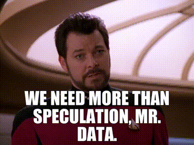

:::::::::::::::::::::::::::::::::::::: questions 

- How much data should we collect and keep for research projects?
- How can we store data carefully?

::::::::::::::::::::::::::::::::::::::::::::::::

::::::::::::::::::::::::::::::::::::: objectives

- Reflect on benefits and drawbacks of data collection
- Consider principles of data minimisation and secure data storage
- Introduce FAIR principles

::::::::::::::::::::::::::::::::::::::::::::::::

## Introduction

When academics first consider using web data as part of their research, they may not consider what they want the data for, or how they will store it. In our current data-rich era, it is all too easy to collect a lot of data without a specific plan for keeping it securely. We might end up with more information than we need or risk losing data due to a lack of planning.

::::::::::::::::: discussion

### Data-rush!

Koen Leurs^[Leurs, Koen. ‘Feminist Data Studies: Using Digital Methods for Ethical, Reflexive and Situated Socio-Cultural Research’. Feminist Review 115, no. 1 (1 March 2017): 130–54. https://doi.org/10.1057/s41305-017-0043-1, 134.] identifies a 'data-rush mentality' which can be witnessed in the arts and humanities. Can you think of any research initiatives which rushed ahead to collect data without careful consideration?

::::::::::::::::::::::::::::::::::::: instructor

- It may be helpful to provide the learners with a specific example from your own research background. This could be drawn from your work, a colleague's work, or a publication, where you felt data could have been collected with more forethought. Offer this anecdote to help the learners reflect on the trend Leurs identifies.

:::::::::::::::::::::::::::::::::::::::::::::::::
:::::::::::::::::::::::::

For music researchers getting started with collecting web data about music, it is natural to be somewhat exploratory. It's also good to be excited about the research potential of web data! However, this section will suggest some ways to carefully consider data collection and data storage rather than simply rushing to get data.

## Data Minimisation

The idea of collecting only the data you need to complete your research is the main principle of **data minimisation**. This term has been used in both legal frameworks and research guidelines.

It is an important part of approaching a research project using web data about music more responsibly. To help *minimise* the data you have means asking questions like:

#### Do I need to collect this type of data?

If you are not planning to analyse date information as part of a research project, you do not strictly need to collect dates (e.g., the date a music video was uploaded).

If you are working on a deidentified corpus of text like user comments, you may not need to collect commenter usernames. Not collecting these would help you [protect users](protecting-users.md).

### Should I delete or 'clean' some of my data?

A clean dataset is a beautiful thing! It may be helpful to consider what types of data you are going to use in your analysis. If you feel you have over-collected some information, for example a list of user IP addresses, it may be prudent to delete it. Third-party tools for collecting web data are likely to err on the side of gathering 'too much' information, some of which you may not need.

### How long do I need to keep this data?

It may be tempting to hold on to data indefinitely. It is simple to leave data you have collected sitting on a hard drive or in cloud storage -- in some senses, the 'default' thing to do. You might also think that you will reuse this data in future. This is a valid consideration, given that social media data, in particular, is dynamic and prone to change. 

However, it is worthwhile considering how long you are keeping it. Arguably, data you have collected at one point in time may become irrelevant or outdated. There could also be legal ramifications for storing personal data for longer than you need. Many data management plans in universities will therefore prompt you to have a 'retention plan': considering *at the start of a project* how long you will keep the data you collect.

::::::::::::::::: callout

### Why data storage matters

As we have already addressed, thinking carefully about the use of data in music research is especially important because the kinds of information users share about music, and the kinds of questions researchers are interested in, are distinctly related to personal identity, culture, and ideology.

::::::::::::::::::::::::::::::::::::: instructor

It may aid memory to cite a couple of examples of music research using web data that learners are interested in, as discussed earlier in the lessons. Focus on the particularities of web data *about music* and briefly suggest why minimising the amount of data collected and the length of time it is stored may be worthwhile considerations.

:::::::::::::::::::::::::::::::::::::::::::::::::
:::::::::::::::::::::::::

## Data Speculation

The idea of collecting a mass of data indiscriminately -- either more than you need, or storing it for longer than you need -- reflects the 'data-rush' mentality. Furthermore, as an overall approach to research, it is not investigative but *speculative*. The term **data speculation** has been critiqued as a process of 'amassing data so as to produce patterns, as opposed to having an idea for which one needs to collect supporting data'.^[Raley, Rita. ‘Dataveillance and Countervailance’. In ‘Raw Data’ Is an Oxymoron, edited by Lisa Gitelman, 121–45. The MIT Press, 2013. https://doi.org/10.7551/mitpress/9302.003.0009, 123.]

{alt='Will Riker of Star Trek: The Next Generation saying "We need more than speculation, Mr. Data."'}

Collecting data then looking for trends is a valid research method. There is **nothing inherently wrong with more exploratory approaches to research**. However, it is likely to increase risks to [users](protecting-users.md) and [researchers](protecting-you.md). 

Consider that you may be holding on to data that a user has since deleted from the web. Holding on to social media data indefinitely is particularly problematic when one considers the rights of users to delete their posts and accounts. In law, this is called the **right to be forgotten**. Datasets collected at a specific point in time will inevitably include posts that users later choose to make private or altogether delete from live platforms, which researchers have ‘little right to maintain – and, in particular, to share’.^[Stockmann, Daniela, and Rebekah Tromble. Lost Umbrellas: Bias and the Right to Be Forgotten in Social Media Research. Edited by Michael Zimmer and Katharina Kinder-Kurlanda. Internet Research Ethics for the Social Age. New York: Peter Lang, 2017. https://doi.org/10.3726/b11077, 89.]

## Data Loss

We have focused on having *too much* data and potentially keeping it *too long*, but there are also risks around losing necessary data you have collected.

::::::::::::::: challenge

### The ephemerality of internet data 

As this episode has emphasised, internet data changes frequently and rapidly. This is why researchers should consider what data they collect and store. 

However, the **ephemeral** nature of web data suggests different courses of action.

* On one hand, it encourages researchers to take *less* data and keep it for *less* time. This might better respect user privacy and ensure data is up-to-date.
* On the other hand, quickly-changing information encourages researchers to keep *more* data and store it for *longer*. This avoids the risk of losing access to data, or failing to fully capture information at a certain point in time.

To resolve these opposing motivations, you should carefully consider what is most appropriate for your specific research project. We will come back to this in the [final lesson of this course.](design.md)

:::::::::::::::::::::::::::

Sometimes social media platforms and other sources of web data transform rapidly: Twitter (now X), a very widely-researched platform, suddenly closed free access to its academic research API in 2023. Given such changes, it was arguably prudent for researchers to collect and store Twitter data!

Regardless of the specific data in question, it is beneficial to act **intentionally** about the data we keep. A researcher may at some point *choose* to delete some data and keep others. However, it is always a poor outcome for data to be lost **by accident**. Because of the ephemeral nature of data, it may be difficult or even impossible to re-collect identical information. 

There are specific steps researchers can take to mitigate data loss. We'll consider some recommended practices shortly.

::::::::::::::::::::::::::::::::::::: challenge

## Data Storage Systems

Imagine you have a set of web data about music stored in one of the following ways. In small groups, spend a few minutes discussing potential problems with keeping data this way. How might the data be lost, compromised, or otherwise insecure?

* In cloud file storage
* In social media DMs
* On a smartphone
* As an email attachment
* On a USB/external hard drive
* On a personal laptop
* On a university computer

::::::::::::::::::::::::::::::::::::: instructor

Here are some suggested issues with each storage system. These are offered to prompt discussion, not the only 'right answers'.

* In cloud file storage: In online storage systems with account access, you might lose access to your data if you lose your password and/or change your mobile number for two-factor verification.
* In social media DMs: Others could gain access to your account. Also, concerns about the social media platform changing access to archived files, attachments etc.
* On a smartphone: You could lose your phone. Others could access if pin-locked or not password-protected at all.
* As an email attachment: Sometimes live in temporary files on computer but not always easy to access. Again, issues with account login and mail services.
* On a USB/external hard drive: Easy to lose. Fragile!
* On a personal laptop: Also easily misplaced and somewhat fragile. Hard drive corruption a common issue.
* On a university computer: Hard drives can be damaged. University sharing settings are confusing. You might lose access to the data if you leave the institution.

:::::::::::::::::::::::::::::::::::::::::::::::::

:::::::::::::::::::::::::::::::::::::::::::::::

There is a widely cited rule-of-thumb for backing up data called the **3-2-1 rule**. This means keeping **3** copies of your data in total, in at least **2** different types of media (e.g., both cloud storage and a USB stick), with **1** copy stored off-site (e.g. not at your usual workplace).

## FAIR Principles

This lesson has covered data collection and storage, but it is also important to consider data sharing. This aspect of data management is addressed by a widely-used research framework, FAIR. This stands for:

*Findable
*Accessible
*Interoperable
*Reusable

FAIR is a set of principles developed by data science academics, publishers, technologists, and funding bodies. As such, it is now embedded in most university data management plans and may be a condition of research grants. 

You won't need to know every point, buty you can browse through the FAIR principles in detail by clicking the drop-down menu.

:::::::::::::::::::::::::::::::::::::::::: spoiler

### FAIR Guiding Principles

To be *Findable*:

F1. (meta)data are assigned a globally unique and persistent identifier  
F2. data are described with rich metadata (defined by R1 below)  
F3. metadata clearly and explicitly include the identifier of the data it describes  
F4. (meta)data are registered or indexed in a searchable resource  

To be *Accessible*:

A1. (meta)data are retrievable by their identifier using a standardized communications protocol  
A1.1 the protocol is open, free, and universally implementable  
A1.2 the protocol allows for an authentication and authorization procedure, where necessary  
A2. metadata are accessible, even when the data are no longer available  

To be *Interoperable*:

I1. (meta)data use a formal, accessible, shared, and broadly applicable language for knowledge representation  
I2. (meta)data use vocabularies that follow FAIR principles  
I3. (meta)data include qualified references to other (meta)data  

To be *Reusable*:

R1. meta(data) are richly described with a plurality of accurate and relevant attributes  
R1.1. (meta)data are released with a clear and accessible data usage license  
R1.2. (meta)data are associated with detailed provenance  
R1.3. (meta)data meet domain-relevant community standards^[Wilkinson, Mark D., Michel Dumontier, Ijsbrand Jan Aalbersberg, Gabrielle Appleton, Myles Axton, Arie Baak, Niklas Blomberg, et al. ‘The FAIR Guiding Principles for Scientific Data Management and Stewardship’. Scientific Data 3, no. 1 (15 March 2016): 160018. https://doi.org/10.1038/sdata.2016.18, 4]  

::::::::::::::::::::::::::::::::::::::::::::::::::

There is increasing pressure on researchers to share collected data, make them widely available online, and improve access to datasets.

We're going to examine open access further in the [next lesson](access.md), but for now it is helpful to briefly reflect on the idea of sharing data.

The call to make research data openly accessible is partly a response to the replication crisis in scientific research. Scholars in the arts and humanities may argue that it is less applicable for research that is not experimental or statistical in nature. However, there are still upsides to sharing datasets that are worth considering, such as being transparent about the information you have used in your work, and democratising access to data.

The downsides include risks of violating user privacy, user reidentification, misleading others through publishing outdated or inaccurate data, and potential backlash against the researcher.

A popular convention is to store any information which might be personal or protected, e.g. user data, in a **closed** dataset and only sharing deidentified, cleaned data in an **open** dataset.^[franzke, aline shakti, Anja Bechmann, Michael Zimmer, and Charles M. Ess. ‘Internet Research: Ethical Guidelines 3.0’. Association of Internet Researchers, 2020. https://aoir.org/reports/ethics3.pdf, 10]

::::::::::::::::::::::::::::::::::::: keypoints 

- Designing research projects should involve careful consideration of what kind of data to collect, how much data to collect, how to store it, and how long to store it
- The principle of data minimisation encourages you to collect and store *less* data
- The dynamic nature of internet data suggests it might be better to collect and store *more* data
- FAIR principles of data management are embedded in university research contexts and should also be carefully considered

::::::::::::::::::::::::::::::::::::::::::::::::

[r-markdown]: https://rmarkdown.rstudio.com/
